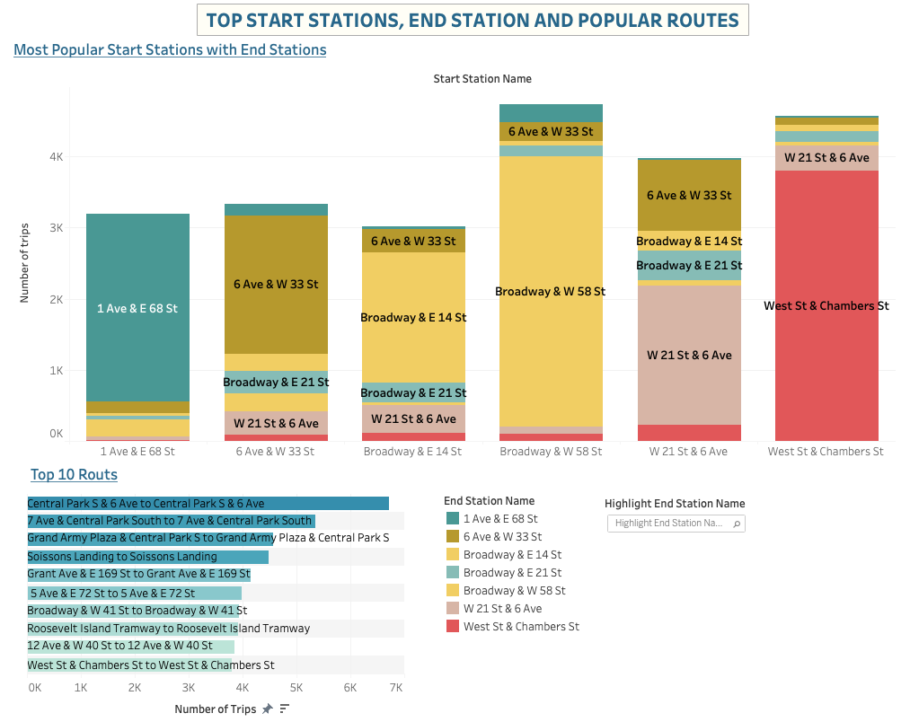

    <h1>NYC Citi Bike Share Program Analysis</h1>
    <h2><i>Winter 2021-22  & Summer 2022 </i></h2>

 

    

 

## Usage Trends

The number of trips for members is much more than for casual customers throughout the year. In the following visualizations, you can see a difference in the behavior of Casual Customers vs. Annual members.

* Generally, passenger traffic in summer is much more than in winter. The number of trips follows a seasonal trend in which more trips are made during warm seasons in contrast with cold seasons. Most trips start and end within the traffic rush hours meaning that the bike-sharing system is used as a solution for NYC traffic congestion. There are similarities and differences in the behavior of members and casual customers.

* The behavior of members and casual customers is different by the day of the week and time of the day.

The heatmap displays the same peaks: 7 am - 9 am and 5 pm - 7 pm.:

* Casual customers (tourists) take the longest trips compared to the members (commuters). This shows that members use the bikes program more often, but for shorter periods of time. Most trips for the members take about 15 minutes in Summer and about 12 minutes in Winter, while for the casual customers, most trips take about 25 minutes in Summer and from 15 to 30 minutes in Winter.

* A detailed breakdown by hours confirms that the busiest time during workdays is in the morning and in the evening when people usually commute to work or home. So, long-term members (subscribers) are mostly commuters, as their peak days are weekdays and peak hours are 8 AM & 5, 6 PM.

* On weekends, the maximum rides fall in the daytime and evening  without obvious peaks.

* Trip Duration Outliers

For members, the trip duration doesn't exceed 2 days and usually is about 1 day or less. For casual customers, the trip duration sometimes exceeds a few days and even 20-30 days, which may be explained by the loss, misuse of bikes or could mean that the bike has gone to maintenance.

* User Type and Bike Type Breakdown

Amount of long-term customers (members) is much more than short-term casual customers.  In summer amount of casual customers increases which can be explained by a large number of tourists. The most popular bike type is a classic bike. Moreover, in summer, the percentage of using a classic bike increases significantly.

## Common Locations

* The network expansion is correlated with housing units’ density and office locations. The most popular bike stations for both starting and ending seem to be places near big commute stations or tourist attractions.  Also, it was noticed that there are a lot of End Stations in Jersey City and Hoboken, while there are no Start Stations in that area.

*  In summer, the number of stations is larger and the geography of their use is wider.

* Top 10 Stations (each station, colored and sized by popularity, is shown below).
Commonly used stations are located within the financial district of Manhattan. 

* The most popular starting stations with the corresponding end stations are shown below. The most popular routes are also shown on the graph. All together, this gives an idea of the most popular points among riders. The most used trip is a path around Central Park and the financial district.

