# NYC Citi Bike Share Program Analysis
## Winter 2021-22 & Summer 2022
<div style="text-align:center">

</div>
<hr>
## Project background

Since 2013, the **Citi Bike Program** has implemented a robust infrastructure for collecting data on the program's utilization. Through the team's efforts, each month bike data is collected, organized, and made public on the ["Citi Bike Data"](https://ride.citibikenyc.com/system-data) webpage.

This project involved extracting a few **NYC Citi Bike datasets** and using to visualize and determine answers to company leadership questions. 

The data was extracted from the website, transformed in a **Jupyter Notebook** using **Python** and **Pandas** then cleaned in a **BigQuery** using **SQL** queries and pushed out to a combined csv to then load into **Tableau**.

Each of the visualizations created contains interactive features for users to explore the different trends related to short-term customers and annual Citi Bike members, peak hours and days of the week, and the breakdown of bike types and seasons (winter and summer).

A report of findings is located in [Analysis.md](Analysis.md).

<hr>

**Some of the questions answered include:**
* How many trips have been recorded total during the chosen period?

* By what percentage has total ridership grown?

* How has the proportion of short-term customers and annual members changed?

* What are the peak hours in which bikes are used during summer months?

* What are the peak hours in which bikes are used during winter months?

* What are the top 10 stations in the city for starting a journey/ ending a journey?

* What are the bottom 10 stations in the city for starting a journey/ ending a journey?

* What is the bikes type breakdown of all participants, short-term customers and annual members?

* How does the average trip duration change?

<hr>

**Datasets Downloaded:** (3 months of Winter 2021-2022 & 3 months of Summer 2022)
- 202112-citibike-tripdata.csv
- 202201-citibike-tripdata.csv
- 202202-citibike-tripdata.csv
- 202206-citibike-tripdata.csv
- 202207-citibike-tripdata.csv
- 202208-citibike-tripdata.csv

**Note:** The datasets used are not included in this folder due to storage space, but can be downloaded from this [website](https://ride.citibikenyc.com/system-data) directly.

<hr>

## Performing analysis

### Transforming dataset with Python and Pandas

* Use Pandas to calculate the difference between two dates (Started time and Ended time).
Check the format of the data:
`df.info()`

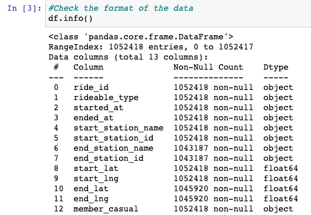


* Convert the dates to datetime format:

```
df['started_at'] = pd.to_datetime(df['started_at'], errors='coerce')
df['ended_at'] = pd.to_datetime(df['ended_at'], errors='coerce')
```
* Calculate the difference between two dates as a timedelta and creating a new column 'tripduration':
`df['tripduration'] = df['ended_at'] - df['started_at']`

* Calculate the difference between two dates in seconds and creating a new column 'tripduration_seconds':
`df['tripduration_seconds'] = (df['ended_at'] - df['started_at']).dt.total_seconds()`

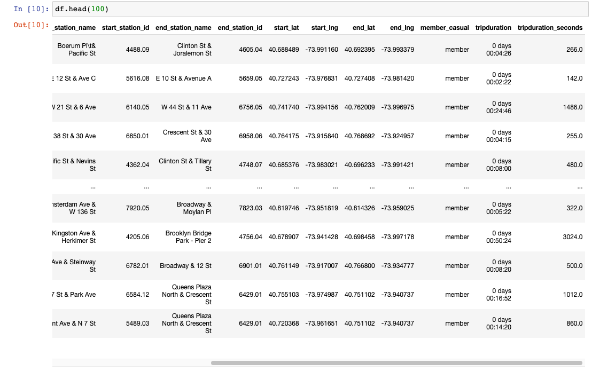

* Export the Dataframe as a new CSV file

Repeate for all 6 files.

### Cleaning the Data with SQL

* Upload 6 CSV files into a BigQuery tables
Create tables for 6 datasets:

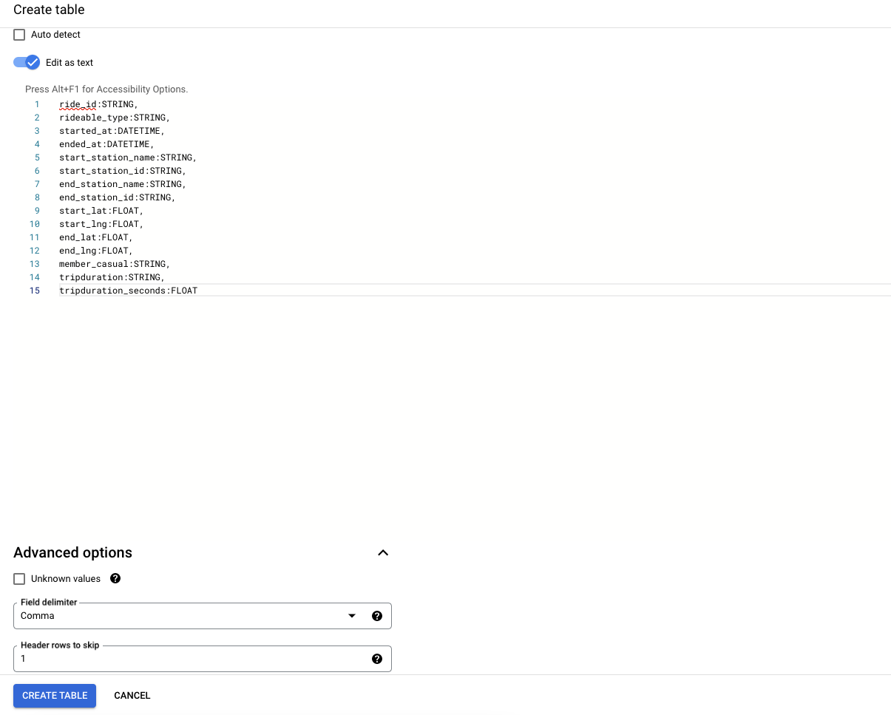

* Create a new column "route":

`CONCAT(start_station_name, " - ", end_station_name) AS route`

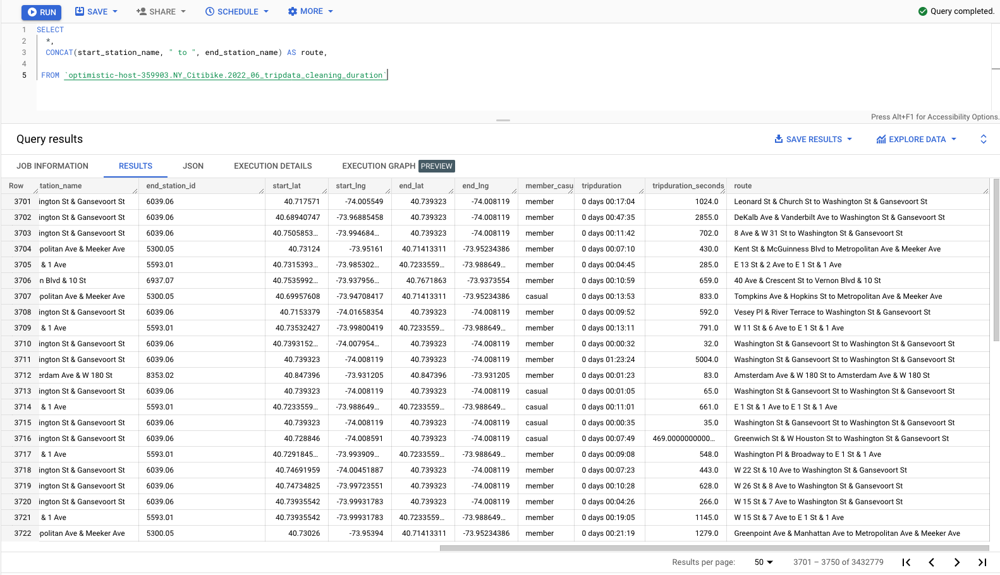

* Cleaning tables with SQL queries

Check and remove negative trip duration:

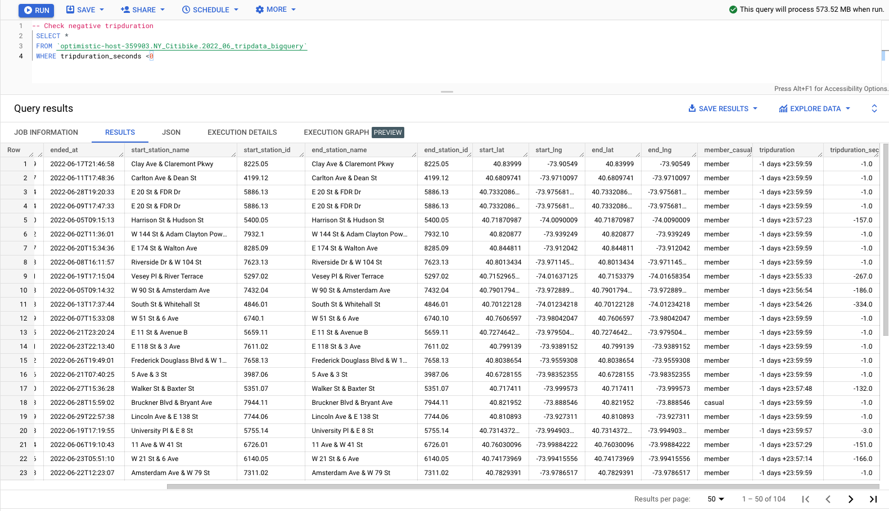

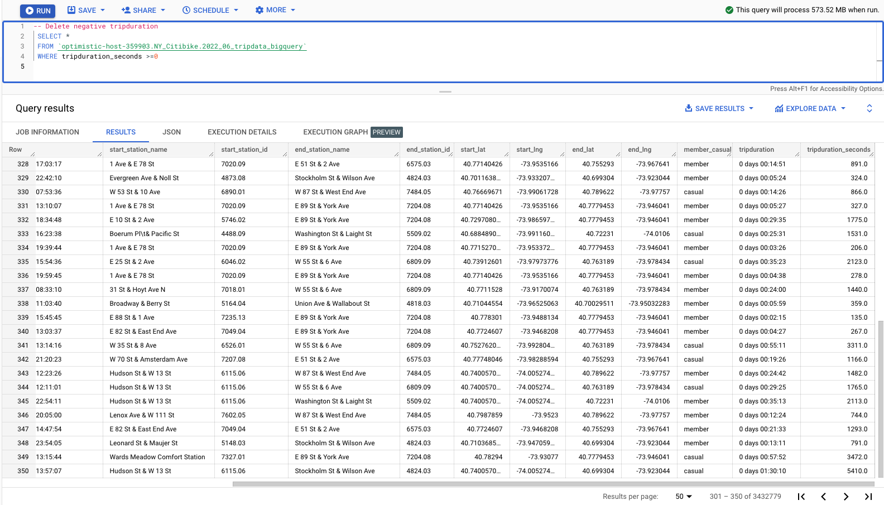

Check and remove NULL data:

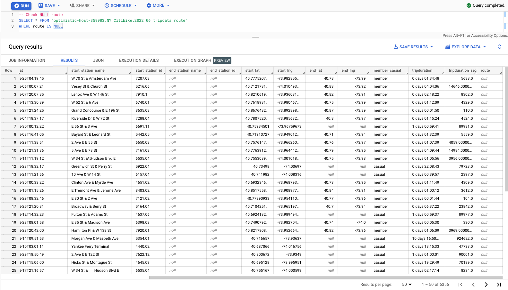

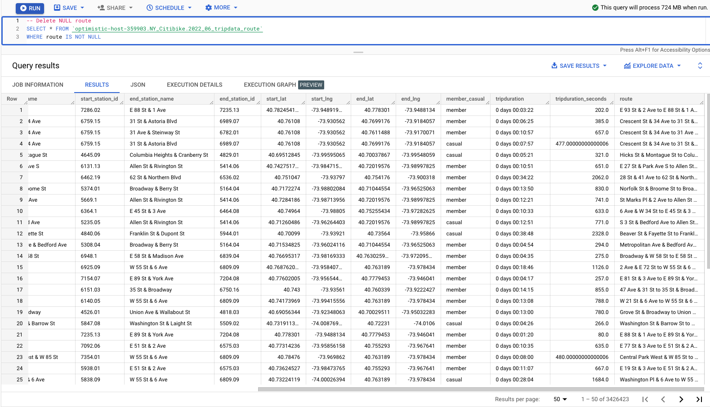

* Save new tables and export as new CSV files

### Aggregate datasets into one CSV file
Jupyter Notebook was used to merge multiple datasets into one file. 

`df_winter_summer = pd.concat([df_202112, df_202201, df_202202, df_202206, df_202207, df_202208], ignore_index=True)`

As a result, one CSV file was received: `[4016535 rows x 16 columns]>`

Then the new Dataframe was exported as new CSV file for further analysis in Tableau.

### Create visualizations, design dashboards and create a Tableau story

**Glimpse of Visualizations:**

#### Popular routes and stations


---
#### Map of bike stations
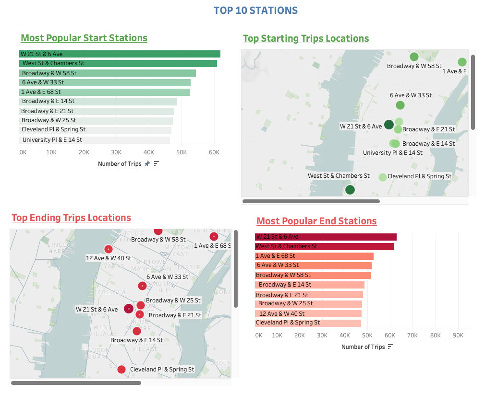


---
#### Peak ridership times dashboard
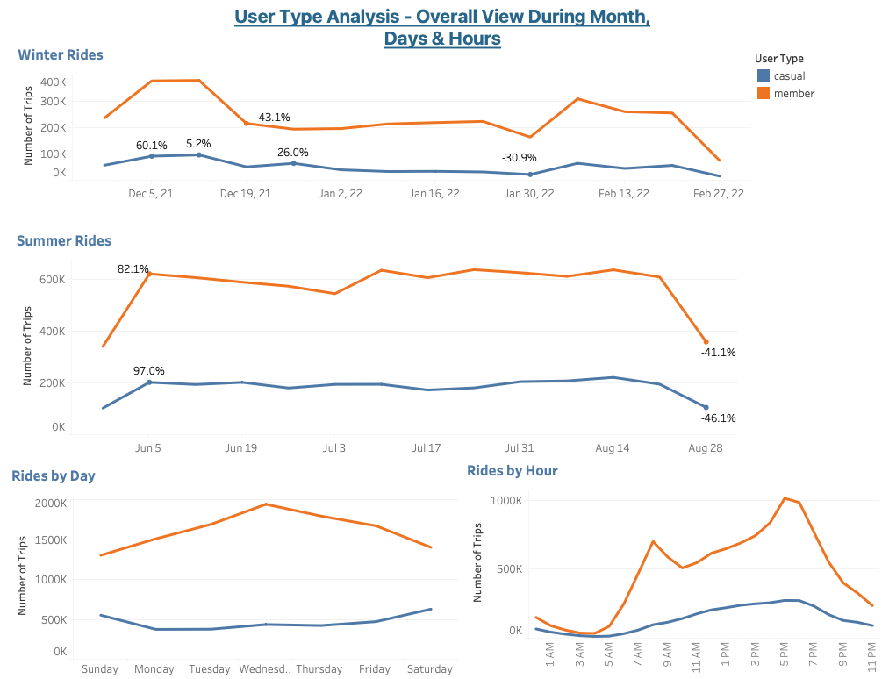

---

#### Outliers
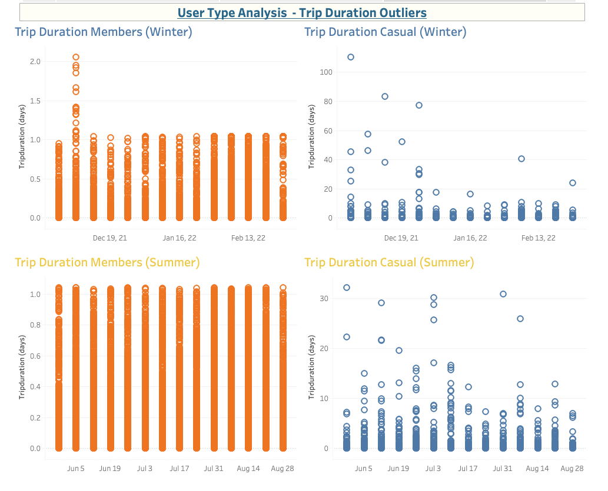

---

#### Peak trips hours during the day
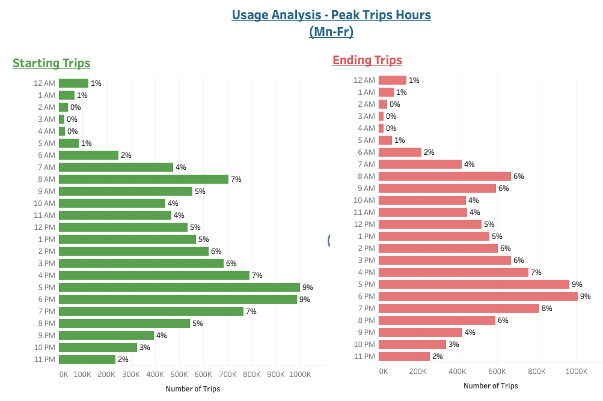
---

#### User type breakdown analysis
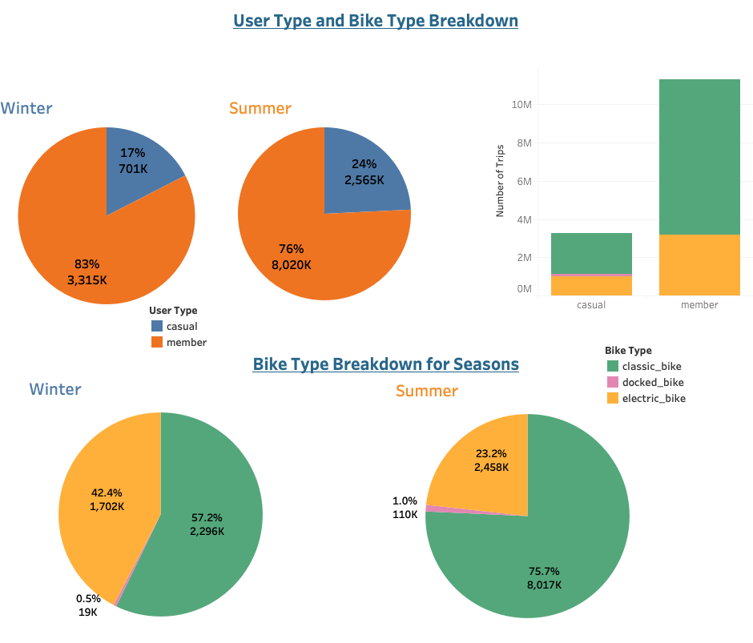


 


